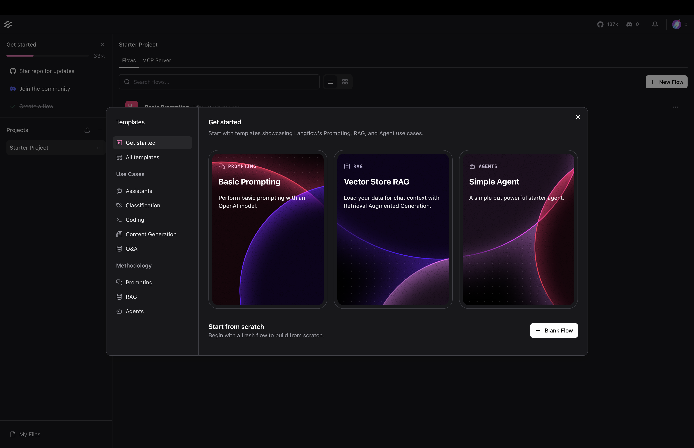
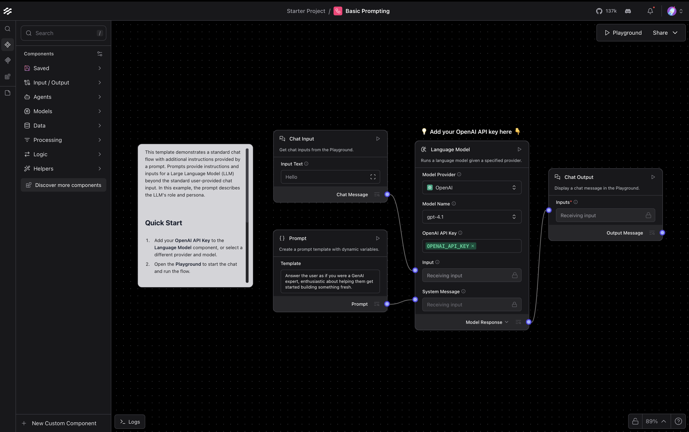
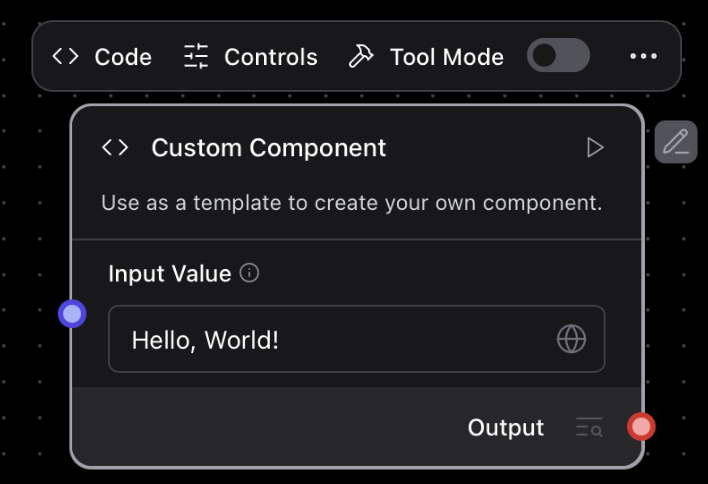
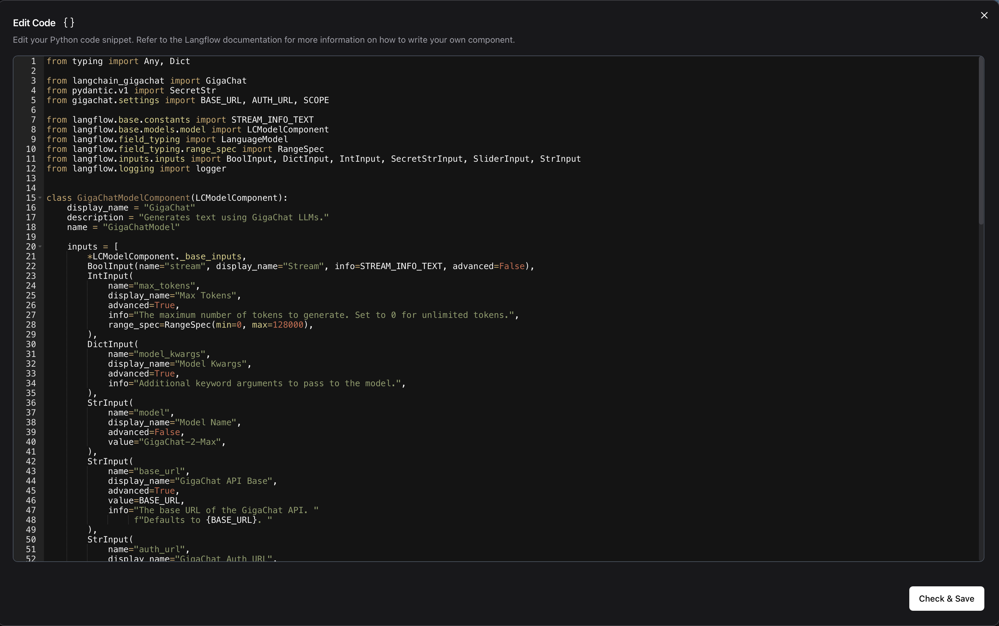
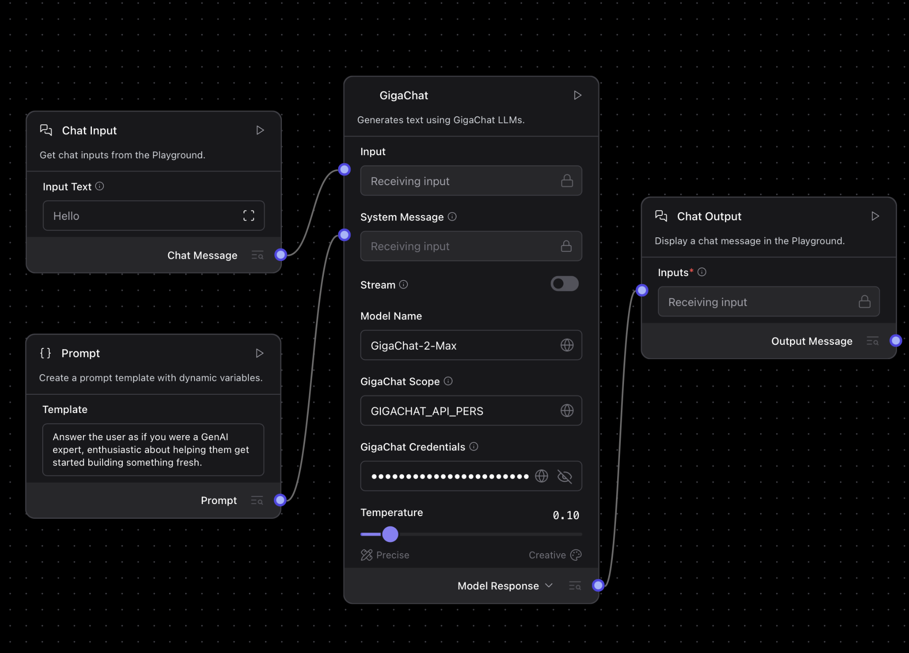
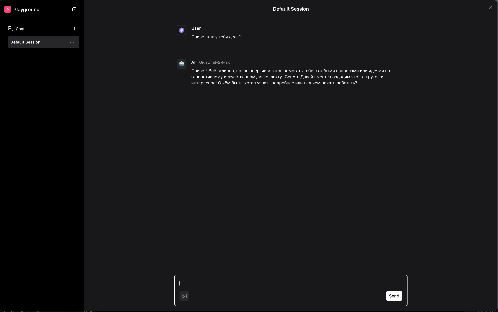
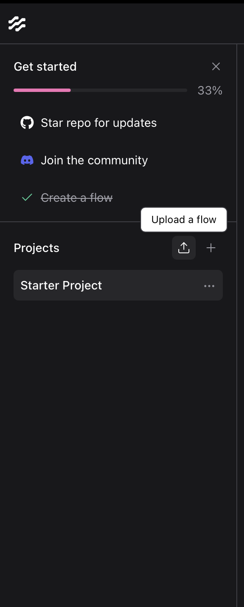

## Что в этом репозитории

В репозитории представлены два независимых сценария работы с Langflow:

- **Вариант 1 — lfx**: программное построение и запуск графов (flows) с помощью `lfx` и/или обращение к уже запущенному Langflow по HTTP.
- **Вариант 2 — Кастомные компоненты Langflow**: подключение своих Python-компонентов в интерфейс Langflow (UI), модели GigaChat.

Предусмотрены два набора компонентов под разные рантаймы:
- `lfx_examples/gigachat_components_lfx/` — компонент GigaChat для `lfx` (используется в коде без UI).
- `gigachat_components/` — компонент GigaChat для Langflow UI.

## Требования

- Python 3.10+
- Рекомендуется менеджер пакетов `uv` (быстро ставит зависимости из `pyproject.toml` и учитывает `uv.lock`)

## Быстрый старт (через uv)

1) Установите `uv` (один из вариантов):

2) https://docs.astral.sh/uv/getting-started/installation/
```bash
brew install uv
# или скриптом:
# curl -LsSf https://astral.sh/uv/install.sh | sh
```

2) Установите зависимости проекта:

```bash
cd /Users/riyakupov/PycharmProjects/langflow_examples
uv sync
```

3) Создайте файл `.env` в корне проекта и добавьте ключи по необходимости:

```bash
# .env
OPENAI_API_KEY=sk-...
# OPENAI_API_BASE=https://api.openai.com/v1  # опционально, если используете прокси/совместимые API

GIGACHAT_CREDENTIALS=YOUR_GIGACHAT_TOKEN
# Доп. параметры для GigaChat (обычно значения по умолчанию подходят)
# GIGACHAT_BASE_URL=...
# GIGACHAT_AUTH_URL=...
# GIGACHAT_SCOPE=GIGACHAT_API_CORP

# Для HTTP-запросов к запущенному Langflow
LANGFLOW_API_KEY=YOUR_LANGFLOW_API_KEY
```

Примечания:
- В примерах используется `python-dotenv` для чтения `.env`. Если при запуске увидите `ImportError: dotenv`, установите пакет: `uv add python-dotenv`.
- Зависимость `langflow` для запуска UI отдельно не входит в `pyproject.toml`. Ниже показано, как запустить UI без глобальной установки через `uvx`.
- Для использования `cp.AgentComponent` можно воспользоваться нашей библиотекой `gpt2giga`: https://github.com/ai-forever/gpt2giga
## Вариант 1. Использование lfx

### 1.1. Запуск графов с помощью lfx run (без UI)

В каталоге `lfx_examples/` есть два минимальных примера:
- `simple_agent_openai.py` — агент на OpenAI
- `simple_gigachat_flow.py` — модель GigaChat как LLM-компонент

Оба файла создают `Graph` и читают ввод из `ChatInput`. Запускайте так:

```bash
# OpenAI пример
uv run lfx run lfx_examples/simple_agent_openai.py "Как дела?"

# GigaChat пример (нужен GIGACHAT_CREDENTIALS в .env)
uv run lfx run lfx_examples/simple_gigachat_flow.py "Привет!"
```

Требуемые переменные окружения:
- Для OpenAI: `OPENAI_API_KEY` (и при необходимости `OPENAI_API_BASE`).
- Для GigaChat: `GIGACHAT_CREDENTIALS` (токен), остальные параметры берутся по умолчанию из SDK.

### 1.2 Запуск графов с помощью lfx serve (как API)

```bash
# OpenAI пример
uv run lfx serve lfx_examples/simple_agent_openai.py

# GigaChat пример (нужен GIGACHAT_CREDENTIALS в .env)
uv run lfx serve lfx_examples/simple_gigachat_flow.py
```

Подробнее можно ознакомиться по ссылке: https://pypi.org/project/lfx/0.1.13/

## Вариант 2. Кастомные компоненты для Langflow (UI)

### 2.1 Использование Langflow Desktop 
[Ссылка на установку](https://www.langflow.org/desktop)

**Установка пользовательских зависимостей в Langflow Desktop**

Чтобы добавить зависимости в Langflow Desktop, внесите запись в файл `requirements.txt` приложения:

*   В macOS файл находится по пути `/Users/ПОЛЬЗОВАТЕЛЬ/.langflow/data/requirements.txt`.
*   В Windows файл находится по пути `C:\Users\ПОЛЬЗОВАТЕЛЬ\AppData\Roaming\com.Langflow\data\requirements.txt`.

В `requirements.txt` нужно добавить библиотеку `langchain-gigachat`

**Использование компонент**



В нижнем левом углу экрана выберите `+ New Custom Component`:



Нажмите на кнопку Code и скопируйте нужный компонент(chat_model, embeddings)



Подключите модель коннекторами



Во вкладке Playground можно протестировать работу:



Также в папке `flow_examples/` лежат примеры, которые можно импортировать: Простой чат-бот, RAG по загруженному документу и простой агент. 

Чтобы импортировать flow, нужно нажать на кнопку `Upload a flow`




### 2.2 Использование Langflow с помощью uv run

### 2.3 Использование Langlow как Docker контейнер
Чтобы подключить кастомные компоненты в Langflow UI, укажите путь к каталогу с компонентами при запуске:

```bash
# Рекомендуемый способ через uvx (не требует глобальной установки langflow)
uvx langflow run \
  --host 127.0.0.1 \
  --port 8001 \
  --components-path /Users/riyakupov/PycharmProjects/langflow_examples/gigachat_components
```

Альтернативно можно использовать переменную окружения:

```bash
export LANGFLOW_COMPONENTS_PATH=/Users/riyakupov/PycharmProjects/langflow_examples/gigachat_components
uvx langflow run --host 127.0.0.1 --port 8001
```

После запуска в UI появится кастомный компонент модели GigaChat (раздел LLM/Models). Настройте в нём:
- `credentials` — токен GigaChat (либо оставьте пустым и задайте `GIGACHAT_CREDENTIALS` в `.env` процесса Langflow)
- при необходимости `base_url`, `auth_url`, `scope`, `temperature`, `timeout` и др.

## Структура репозитория

```text
/Users/riyakupov/PycharmProjects/langflow_examples/
  ├─ gigachat_components/                # Кастомные компоненты для Langflow UI
  │   └─ gigachat_chat_model.py
  ├─ lfx_examples/                       # Примеры для lfx (без UI) и HTTP-запросов
  │   ├─ simple_agent_openai.py
  │   ├─ simple_gigachat_flow.py
  │   ├─ request_to_flow.py
  │   └─ gigachat_components_lfx/
  │       └─ gigachat_chat_model.py      # Компонент GigaChat для lfx
  ├─ pyproject.toml                      # Основные зависимости проекта
  ├─ uv.lock                             # lock-файл для uv
  └─ langflow.log                        # файл логов (создаётся примерами)
```

## Подсказки и устранение неполадок

- **dotenv не найден**: `uv add python-dotenv`.
- **Нет команды langflow**: используйте `uvx langflow ...` (скачает и запустит Langflow в изолированной среде).
- **401/403 при запросе к Flow**: проверьте `LANGFLOW_API_KEY` и что сервер Langflow запущен на `127.0.0.1:8001`.
- **GigaChat авторизация**: проверьте валидность `GIGACHAT_CREDENTIALS` и (при необходимости) корпоративный `scope`.
- **OpenAI доступ**: проверьте `OPENAI_API_KEY` и лимиты/региональные настройки. Для совместимых API укажите `OPENAI_API_BASE`.

## Лицензия

Укажите условия лицензирования, если требуется (например, MIT). Если файла LICENSE нет — оставьте этот раздел как напоминание.
