## Что в этом репозитории

В репозитории представлены два независимых сценария работы с Langflow:

- **Вариант 1 — lfx**: программное построение и запуск графов (flows) с помощью `lfx` и/или обращение к уже запущенному Langflow по HTTP.
- **Вариант 2 — Кастомные компоненты Langflow**: подключение своих Python-компонентов в интерфейс Langflow (UI), модели GigaChat.

Предусмотрены два набора компонентов под разные рантаймы:
- `lfx_examples/gigachat_components_lfx/` — компонент GigaChat для `lfx` (используется в коде без UI).
- `gigachat/` — компонент GigaChat для Langflow UI.

## Требования

- Python 3.10+
- Рекомендуется менеджер пакетов `uv` (быстро ставит зависимости из `pyproject.toml` и учитывает `uv.lock`)

## Быстрый старт (через uv)

1) Установите `uv`[Ссылка](https://docs.astral.sh/uv/getting-started/installation/)

```bash
brew install uv
# или скриптом:
# curl -LsSf https://astral.sh/uv/install.sh | sh
```

2) Установите зависимости проекта:

```bash
uv sync
```

3) Создайте файл `.env` в корне проекта и добавьте ключи по необходимости:

```bash
cp .env_example .env
```

```bash
# .env
OPENAI_API_KEY=sk-...
# OPENAI_API_BASE=https://api.openai.com/v1  # опционально, если используете прокси/совместимые API

GIGACHAT_CREDENTIALS=YOUR_GIGACHAT_TOKEN
# Доп. параметры для GigaChat (обычно значения по умолчанию подходят)
# GIGACHAT_SCOPE=GIGACHAT_API_{CORP/PERS/B2B} (по умолчанию PERS)
# GIGACHAT_BASE_URL=...
# GIGACHAT_AUTH_URL=...

# Для HTTP-запросов к запущенному Langflow
# Может быть любой, предназначен для защиты сервиса
LANGFLOW_API_KEY=0
```

Примечания:
- В примерах используется `python-dotenv` для чтения `.env`. Если при запуске увидите `ImportError: dotenv`, установите пакет: `uv add python-dotenv`.
- Зависимость `langflow` для запуска UI отдельно не входит в `pyproject.toml`. Ниже показано, как запустить UI без глобальной установки через `uvx`.
- Для использования `cp.AgentComponent` можно воспользоваться нашей библиотекой [gpt2giga](https://github.com/ai-forever/gpt2giga).
## Вариант 1. Использование lfx

### 1.1. Запуск графов с помощью lfx run (без UI)
> [!IMPORTANT]
> На данный момент lfx работает на langchain версии <1.
> Учитывайте это в своих проектах.

В каталоге `lfx_examples/` есть два минимальных примера:
- `simple_agent_openai.py` — агент на OpenAI
- `simple_gigachat_flow.py` — модель GigaChat как LLM-компонент

Оба файла создают `Graph` и читают ввод из `ChatInput`.

```bash
# Доступные аргументы:
uv run lfx run --help
# OpenAI пример
uv run lfx run lfx_examples/simple_agent_openai.py  -f text 'Как дела?'

# GigaChat пример (нужен GIGACHAT_CREDENTIALS в .env)
uv run lfx run lfx_examples/simple_gigachat_flow.py -f text 'Привет' 
```

Требуемые переменные окружения:
- Для OpenAI: `OPENAI_API_KEY` (и при необходимости `OPENAI_API_BASE`).
- Для GigaChat: `GIGACHAT_CREDENTIALS` (токен), `GIGACHAT_SCOPE` остальные параметры берутся по умолчанию из SDK.

### 1.2 Запуск графов с помощью lfx serve (как API)
Нужно обязательно указать `LANGFLOW_API_KEY`, он может быть любой
```bash
# Доступные аргументы:
uv run lfx serve --help
# OpenAI пример
uv run lfx serve lfx_examples/simple_agent_openai.py  --env-file .env

# GigaChat пример (нужен GIGACHAT_CREDENTIALS в .env)
uv run lfx serve lfx_examples/simple_gigachat_flow.py --env-file .env
```
Подробнее можно ознакомиться по ссылке: [lfx](https://pypi.org/project/lfx/0.1.13/)

## Вариант 2. Кастомные компоненты для Langflow (UI)

### 2.1 Использование Langflow Desktop 
[Ссылка на установку](https://www.langflow.org/desktop)

**Установка пользовательских зависимостей в Langflow Desktop**

Чтобы добавить зависимости в Langflow Desktop, внесите запись в файл `requirements.txt` приложения:

*   В macOS файл находится по пути `/Users/ПОЛЬЗОВАТЕЛЬ/.langflow/data/requirements.txt`.
*   В Windows файл находится по пути `C:\Users\ПОЛЬЗОВАТЕЛЬ\AppData\Roaming\com.Langflow\data\requirements.txt`.

В `requirements.txt` нужно добавить библиотеку `langchain-gigachat`

**Начальная страница**

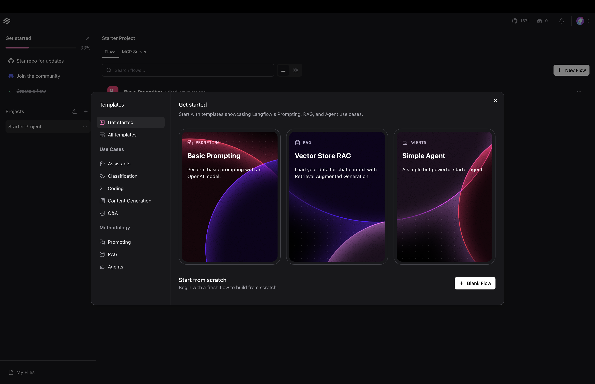

**Использование компонент**

В нижнем левом углу экрана выберите `+ New Custom Component`:

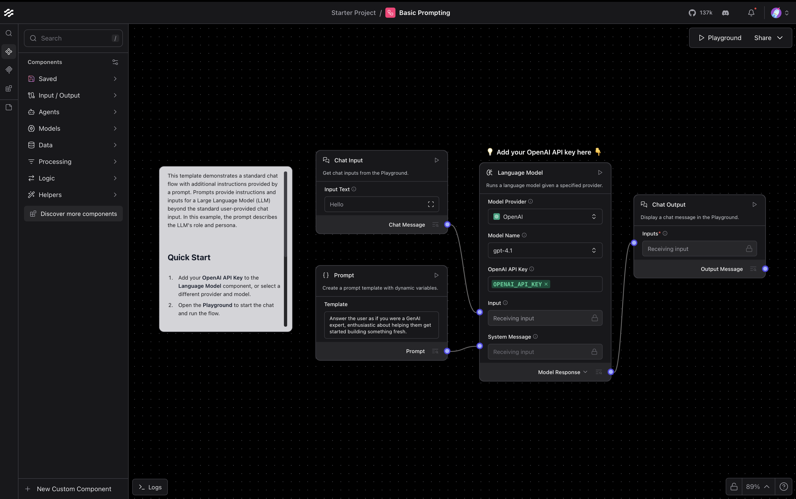

Нажмите на кнопку Code и скопируйте нужный компонент(chat_model, embeddings)
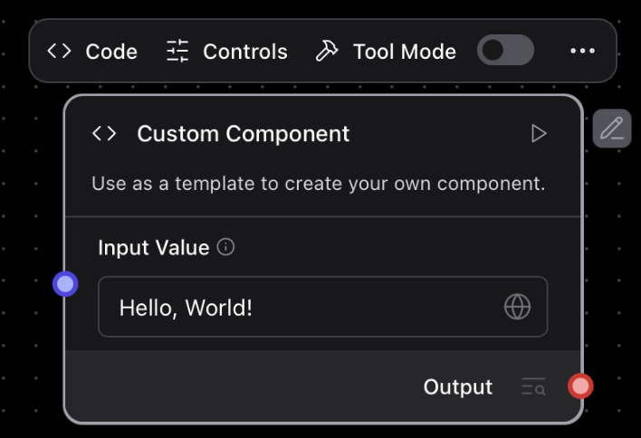
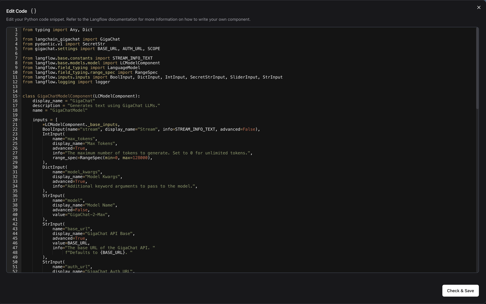

Подключите модель коннекторами

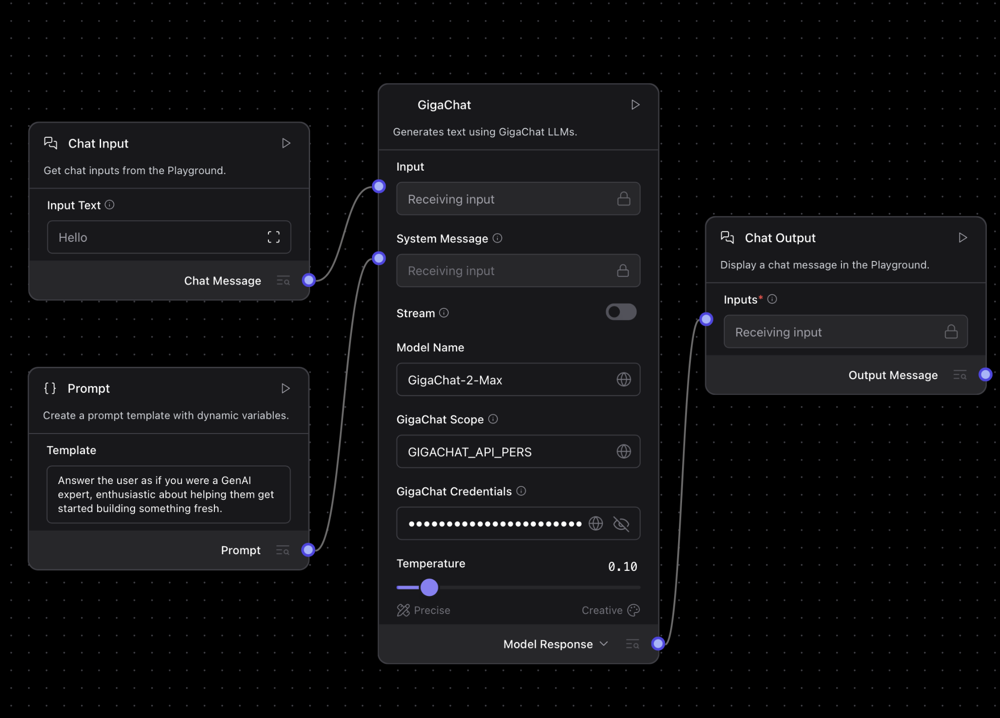

Во вкладке Playground можно протестировать работу:

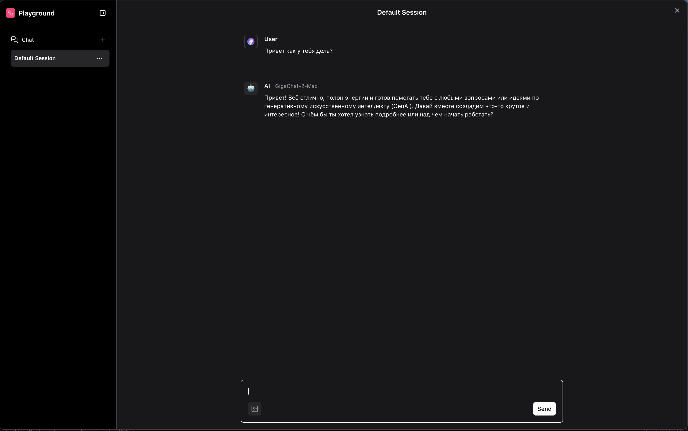

Также в папке `flow_examples/` лежат примеры, которые можно импортировать: Простой чат-бот, RAG по загруженному документу и простой агент. 

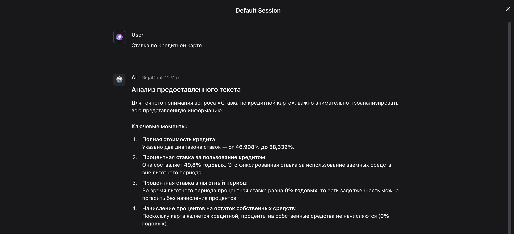

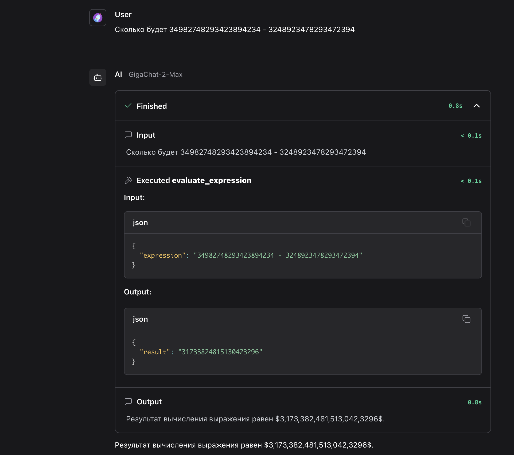

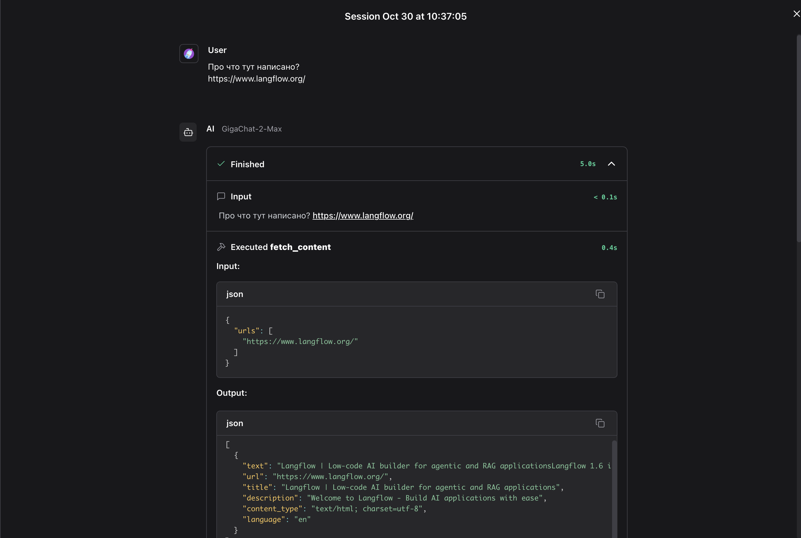

Чтобы импортировать flow, нужно нажать на кнопку `Upload a flow`

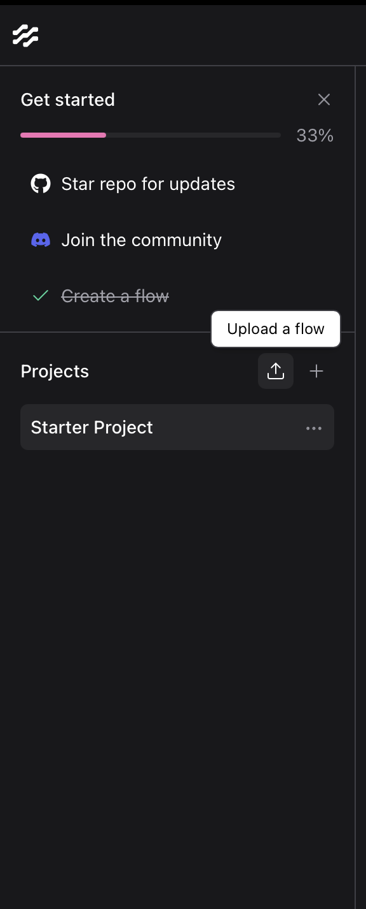


### 2.2 Использование Langflow с помощью uv run

```bash
uv add langflow
uv add langchain-gigachat
```

```bash
uv run langflow run --components_path PATH_TO_GIGACHAT_COMPONENTS
```

После запуска компоненты будут отображаться в UI:

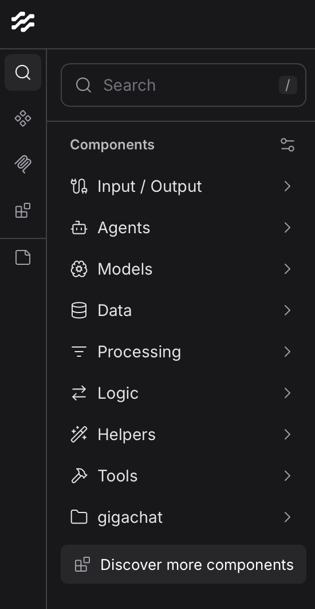

### 2.3 Использование Langlow как Docker контейнер
В репозитории приведен пример [Dockerfile](components.Dockerfile) и [docker-compose.yaml](docker-compose.yaml)

```bash
docker compose up --build -d
```
Или:
```bash
docker build . -f components.Dockerfile -t gigachat-langflow:latest
docker run -p 7860:7860 --name langflow_gigachat gigachat-langflow:latest
```
Cписок доступных ENV переменных доступен по [ссылке](https://docs.langflow.org/environment-variables)
## Структура репозитория

```text
langflow_examples/
  ├─ flow_examples # Примеры flow, которые можно загрузить в Langflow
  ├─ gigachat/                # Кастомные компоненты для Langflow UI
  │   ├─ gigachat_chat_model.py
  │   └─ gigachat_embeddings.py
  ├─ images/ # Примеры с изображениями
  ├─ lfx_examples/                       # Примеры для lfx (без UI) и HTTP-запросов
  │   ├─ simple_agent_openai.py
  │   ├─ simple_gigachat_flow.py
  │   ├─ request_to_flow.py
  │   └─ gigachat_components_lfx/
  │       └─ gigachat_chat_model.py      # Компонент GigaChat для lfx
  ├─ components.Dockerfile # Пример Dockerfile
  ├─ docker-compose.yaml # Пример compose
  ├─ pyproject.toml                      # Основные зависимости проекта
  └─ README.md
```
